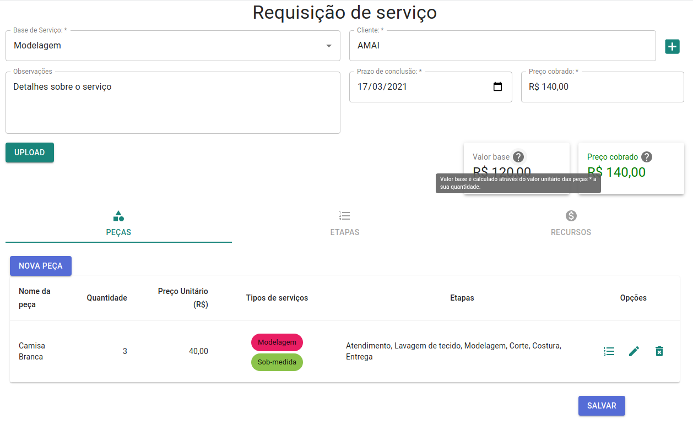
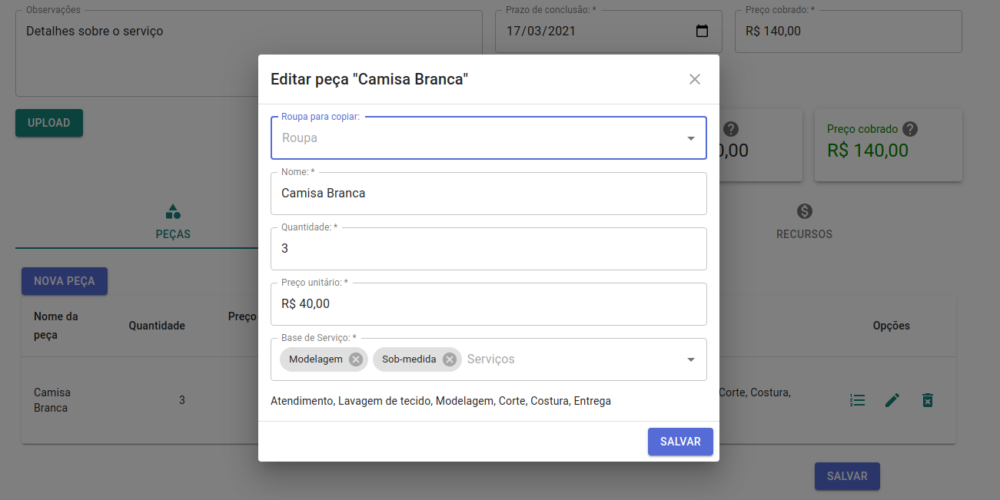
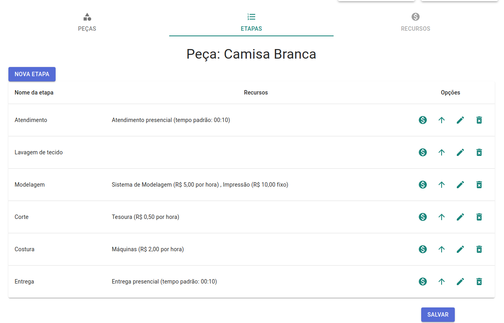
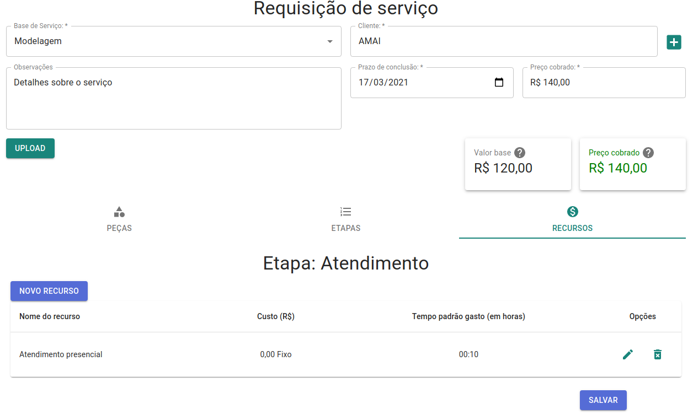
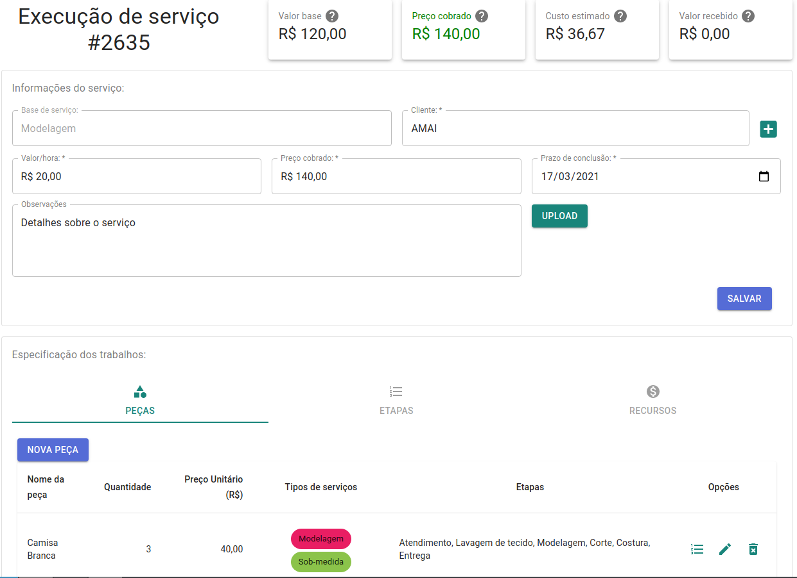
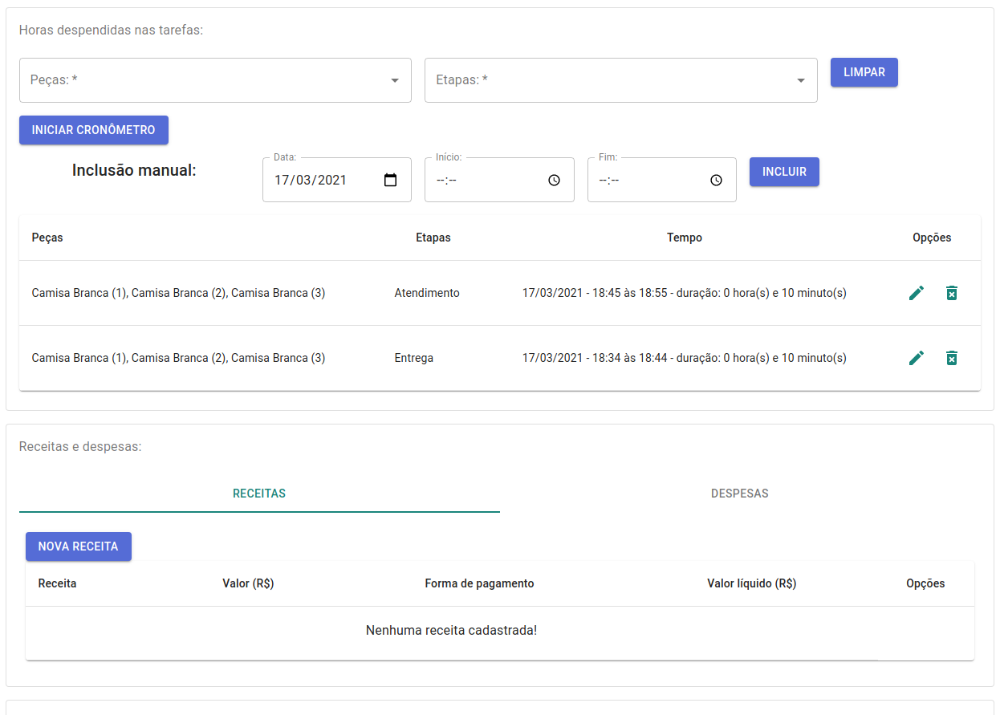
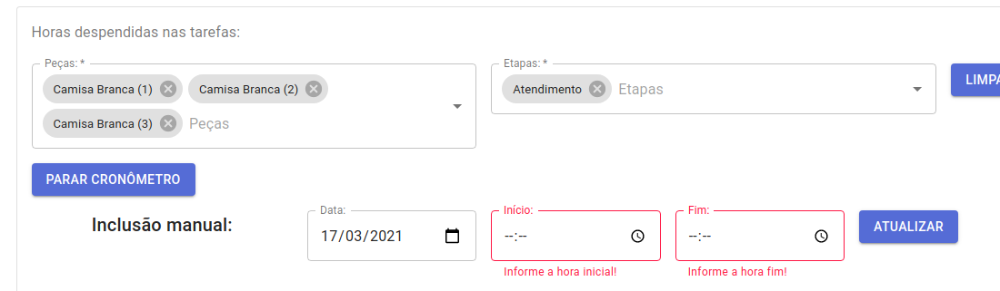
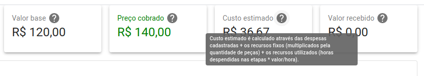
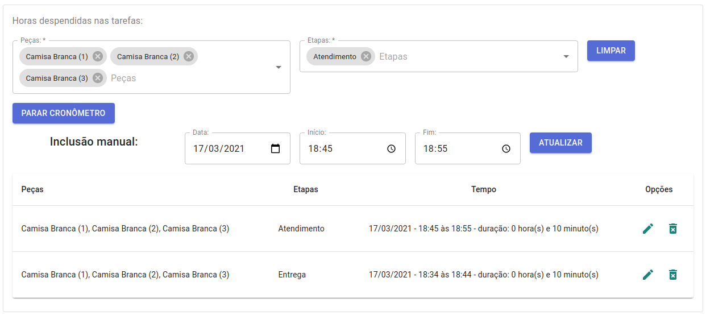
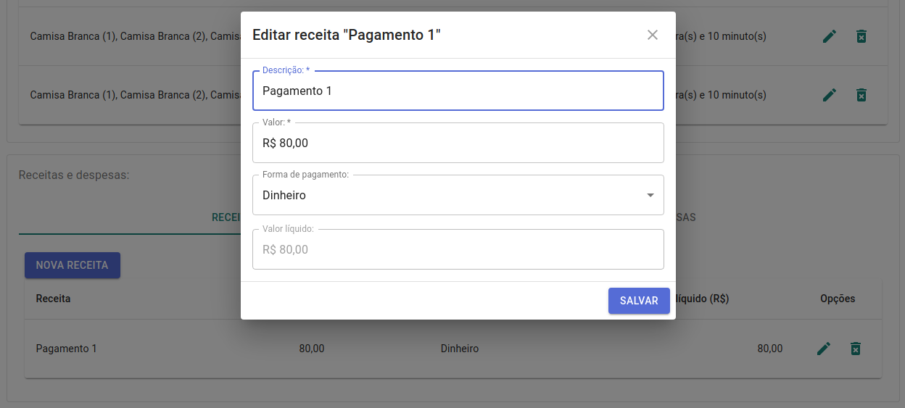

 # Atelier manager - Prototype app

Was developed a pure frontend app (without backend - prototype) to check the app major functionallity, usability and help to mature the domain design. These result was validated with stakeholder.

Above some developed app prints. To check and run app, see README.md file in atelier-app folder.

## Service requisition

User can input a service base and customer (can search by name or select a option), input comments, deadline and price.

Above, user can register cloths, steps and resources that will be produzed.

A cloth edition and your informations.

Being steps to product/fix the selected cloth.

Resources that will be used on selected step. These resources have fixed or by hour costs that will used to calculate the production cost.

## Service execution

After requisited, a service can be started, and others informations, like spended hours and revenues/expenses can be informed.

All fields have validations on save action, fields with error are showed.

Values and calculed values are showed with tips explaining how these values are calculated.

Spended times can be informed with one cloth and step per time, or with more clothes and steps together. Spended time is used to calculate some resource costs and labor costs (with field hours price).

Revenue and expense can be informed to manage these incomes and outcomes. Some expenses like buying cloths, buttons, zipper and others stuffs. Revenues can be customer payments. 